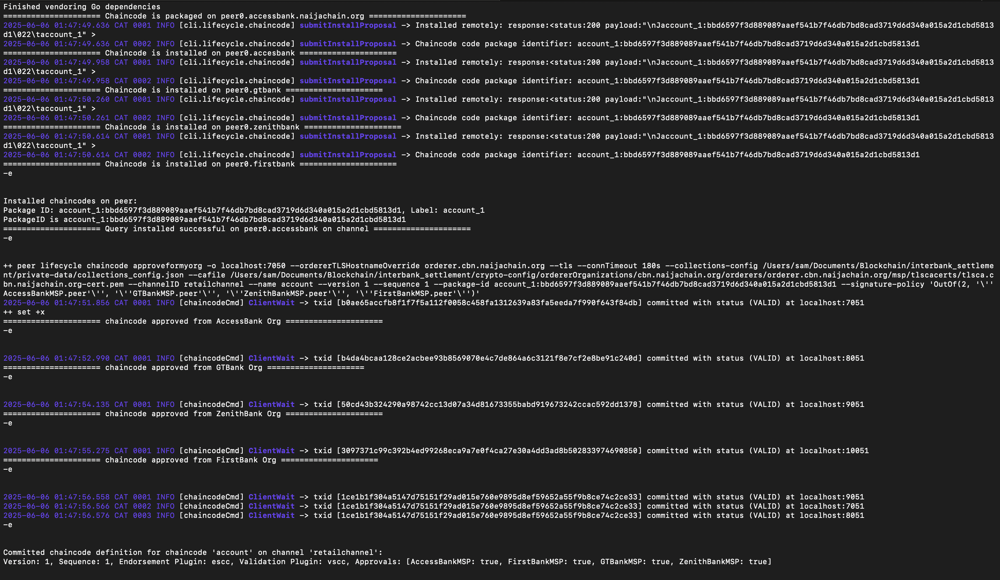
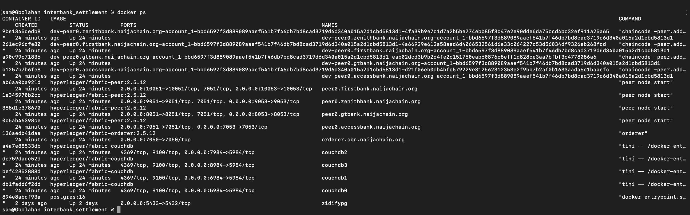
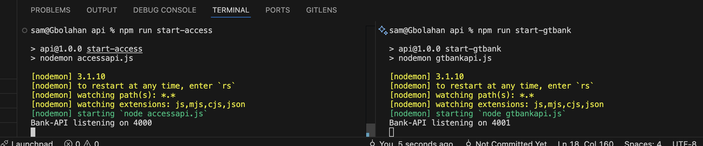
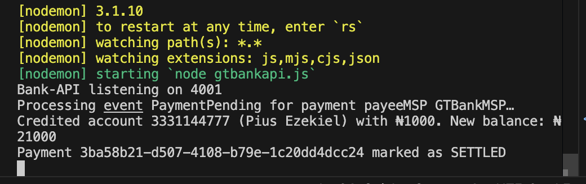

# NaijaChain: Blockchain-Powered Inter-Bank Settlement System


A **gross settlement system** with **atomic finality**, designed for small-value, high-frequency retail transactions between Nigerian banks using **Hyperledger Fabric**.

## 🎥 Demo

**Final Product Demo (July 4th):** [Final Product Demo](https://drive.google.com/file/d/1hhUpM2_TTzZJJOnnGEZcdWiq_RjY5Kvh/view?usp=sharing)

**Initial Prototype Demo:** [https://youtu.be/01Aw6APLV28](https://youtu.be/01Aw6APLV28)

## 📂 Repository

**GitHub:** [https://github.com/SundayOlubode/interbank_settlement](https://github.com/SundayOlubode/interbank_settlement.git)

## ⚠️ Disclaimer

_All organizations mentioned are used strictly for academic and illustrative purposes. This project is not affiliated with or endorsed by any named institution._

---

## 🚀 Features

- **Atomic Settlement**: Instant finality with blockchain consensus
- **Private Data Collections**: Confidential transaction details between bank pairs
- **Multi-Bank Network**: Support for multiple Nigerian banks (AccessBank, GTBank, ZenithBank, FirstBank)
- **High Throughput**: Optimized for small-value, high-frequency transactions
- **RESTful APIs**: Easy integration with existing bank systems
- **Real-time Processing**: Immediate settlement notifications
- **Audit Trail**: Immutable transaction history on blockchain

## 🏗️ Architecture

### Network Components

- **4 Bank Organizations**: AccessBank, GTBank, ZenithBank, FirstBank
- **Channel**: `retailchannel` for inter-bank transactions
- **Chaincode**: `account` smart contract for payment processing
- **Private Data Collections**: Confidential data sharing between bank pairs

### Technology Stack

- **Blockchain Platform**: Hyperledger Fabric 2.x
- **Smart Contracts**: Go (Golang)
- **Backend APIs**: Node.js with Express
- **Database**: CouchDB (for rich queries)
- **Containerization**: Docker & Docker Compose

---

## 📋 Prerequisites

Before setting up NaijaChain, ensure you have the required prerequisites installed:

### System Requirements

- **Operating System**: Linux (Ubuntu 18.04+) or macOS
- **Memory**: Minimum 8GB RAM
- **Storage**: At least 20GB free space

### Required Software

Visit [Hyperledger Fabric Prerequisites](https://hyperledger-fabric.readthedocs.io/en/latest/prereqs.html) and install:

- **Docker**: v20.10.x or higher
- **Docker Compose**: v1.29.x or higher
- **Node.js**: v16.x or v18.x
- **npm**: v8.x or higher
- **Go**: v1.19.x or higher (for chaincode development)
- **Git**: Latest version

### Hyperledger Fabric Binaries

```bash
curl -sSL https://bit.ly/2ysbOFE | bash -s -- 2.4.7 1.5.3
```

---

## 🔧 Installation & Setup

### 1. Clone the Repository

```bash
git clone https://github.com/SundayOlubode/interbank_settlement.git
cd interbank_settlement
```

### 2. Initialize the Network

```bash
# Make the script executable
chmod +x restartAll.sh

# Start the entire network
./restartAll.sh
```

This script will:

- Generate crypto materials for all bank organizations
- Create the `retailchannel` channel
- Join all peers to the channel
- Deploy and approve the chaincode
- Initialize private data collections

### 3. Verify Network Setup

After successful execution, your terminal should look like this:



Check running containers:

```bash
docker ps
```

You should see containers similar to:



### 4. Start Bank API Services

Navigate to the API directory and install dependencies:

```bash
cd api
npm install
```

Start the bank API services in separate terminals:

**Terminal 1 - AccessBank API:**

```bash
npm run start-access
```

**Terminal 2 - GTBank API:**

```bash
npm run start-gtbank
```

Both servers should display startup messages similar to:



---

## 💳 Usage Examples

### Making a Payment

Send a POST request to initiate an inter-bank payment:

**Endpoint:** `POST localhost:4000/payments`

**Payload:**

```json
{
  "payerAcct": "0506886519",
  "payeeMSP": "GTBankMSP",
  "payeeAcct": "3331144777",
  "amount": 1000
}
```

**Response:**

```json
{
  "id": "a55b8dca-045d-49ae-a00a-1ab4a92409d3",
  "status": "PENDING"
}
```

### Payment Settlement

Upon successful processing, the receiving bank (GTBank) will display settlement confirmation:



---

## 📡 API Documentation

### Payment APIs

#### Create Payment

- **POST** `/payments`
- **Description**: Initiate a new inter-bank payment
- **Body Parameters**:
  - `payerAcct` (string): Sender's account number
  - `payeeMSP` (string): Recipient bank's MSP ID
  - `payeeAcct` (string): Recipient's account number
  - `amount` (number): Payment amount

### Blockchain Data APIs

#### Get All Blocks

- **GET** `/blocks`
- **Query Parameters**:
  - `businessOnly=true`: Filter out system transactions

#### Get Private Data Collections

- **GET** `/private-data/:collection/all`
- **Description**: Retrieve all data from a private data collection
- **Example**: `/private-data/col-AccessBankMSP-GTBankMSP/all`

### Example API Calls

```bash
# Get business transactions only
GET localhost:4000/blocks?businessOnly=true

# Get all private data between AccessBank and GTBank
GET localhost:4000/private-data/col-AccessBankMSP-GTBankMSP/all
```

---

## 🔐 Private Data Collections

The system uses private data collections to maintain confidentiality between bank pairs:

- `col-AccessBankMSP-GTBankMSP`: AccessBank ↔ GTBank transactions
- `col-AccessBankMSP-ZenithBankMSP`: AccessBank ↔ ZenithBank transactions
- `col-AccessBankMSP-FirstBankMSP`: AccessBank ↔ FirstBank transactions
- `col-GTBankMSP-ZenithBankMSP`: GTBank ↔ ZenithBank transactions
- `col-GTBankMSP-FirstBankMSP`: GTBank ↔ FirstBank transactions
- `col-ZenithBankMSP-FirstBankMSP`: ZenithBank ↔ FirstBank transactions

Each collection contains sensitive payment details that are only accessible to the participating banks.

---

## 👨‍💻 Author

**Samuel Olubode**

- GitHub: [@SundayOlubode](https://github.com/SundayOlubode)
